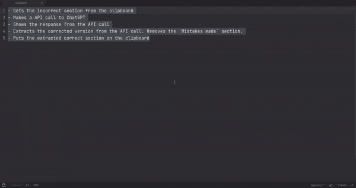

# Grammar Checker with ChatGPT

**Upgraded version 2.0**

## AutoHotKey + Go powered grammar checker that revises sections of text, teaches you about the mistakes and fixes those mistakes. Powered with ChatGPT.

This projects was poorly documentated in [my blog posts](https://anyfactor.github.io/):

- https://anyfactor.github.io/posts/chatgpt_grammar_checker/
- https://anyfactor.github.io/posts/upgrading_my_grammar_automation_script/

## Prerequisites

This code is only functional in Windows ecosystems due to AHK supporting only Windows. However, since the backend is written in Go, this solution can be ported to Linux and Mac, provided you have tools that support keystroke-based triggers and easy clipboard management.

For this project you need:

- ChatGPT API token
- Autohotkey 2.0 (Code: `./autohotkey`)
- Go* (Code: `./go_project`)

\* If the project recieves more than 20 stars I will set up the Go binary release on this repo.

## How does it work:

### Autohotkey

The AHK script binds operation to the F8 button which can be replaced with any button you want. You also need to provide the path to Go executable in the AHK script.

- First, select the text, and then press F8.
- This will trigger the AHK operation.
- AHK runs Ctrl+C to copy the selected text.
- AHK asynchronously triggers the Go script and the windows tray alert.
- As soon as the Go script has finished running, it pastes the corrected section over the selected input section.

### Go

The Go script requires a ChatGPT token.

- ChatGPT retrieves the text from the clipboard section.
- Then, it calls the ChatGPT API using the prompt: "Fix the grammar errors and list out the mistakes made: {text}".
- Next, it receives the results and saves them to the clipboard.
- It displays the corrected version of the input, along with the mistakes.
- The corrected version, without the mistakes, is saved in the clipboard.
- When you press `enter`, the AHK operation resumes and the corrected section is pasted over the selected text.

## Notes

This project was previously created with using Powershell and AHK. But due Powershell's limitation, I decided to upgrade it.

Feel free to have a chat with me. My contact is in my blog: https://anyfactor.github.io